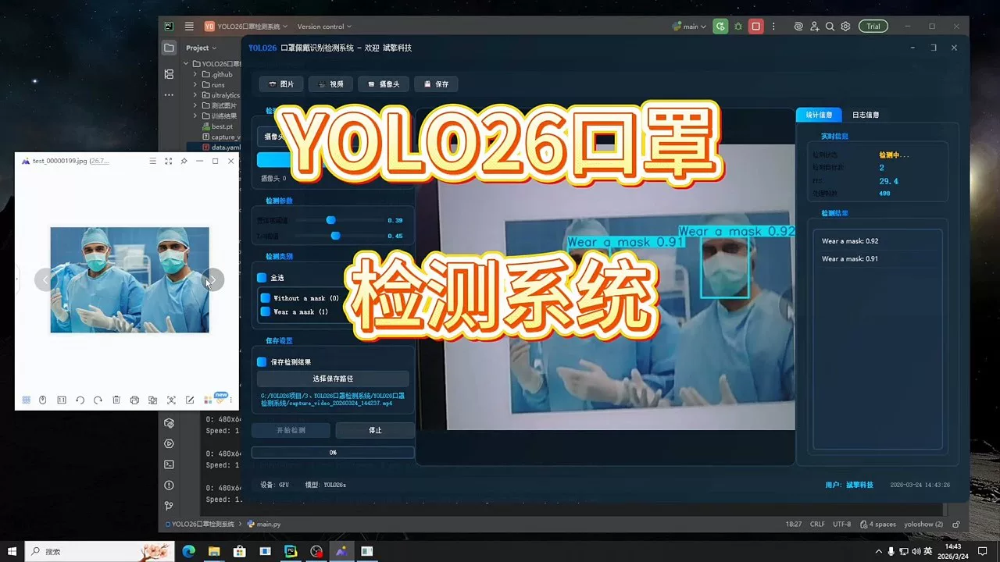
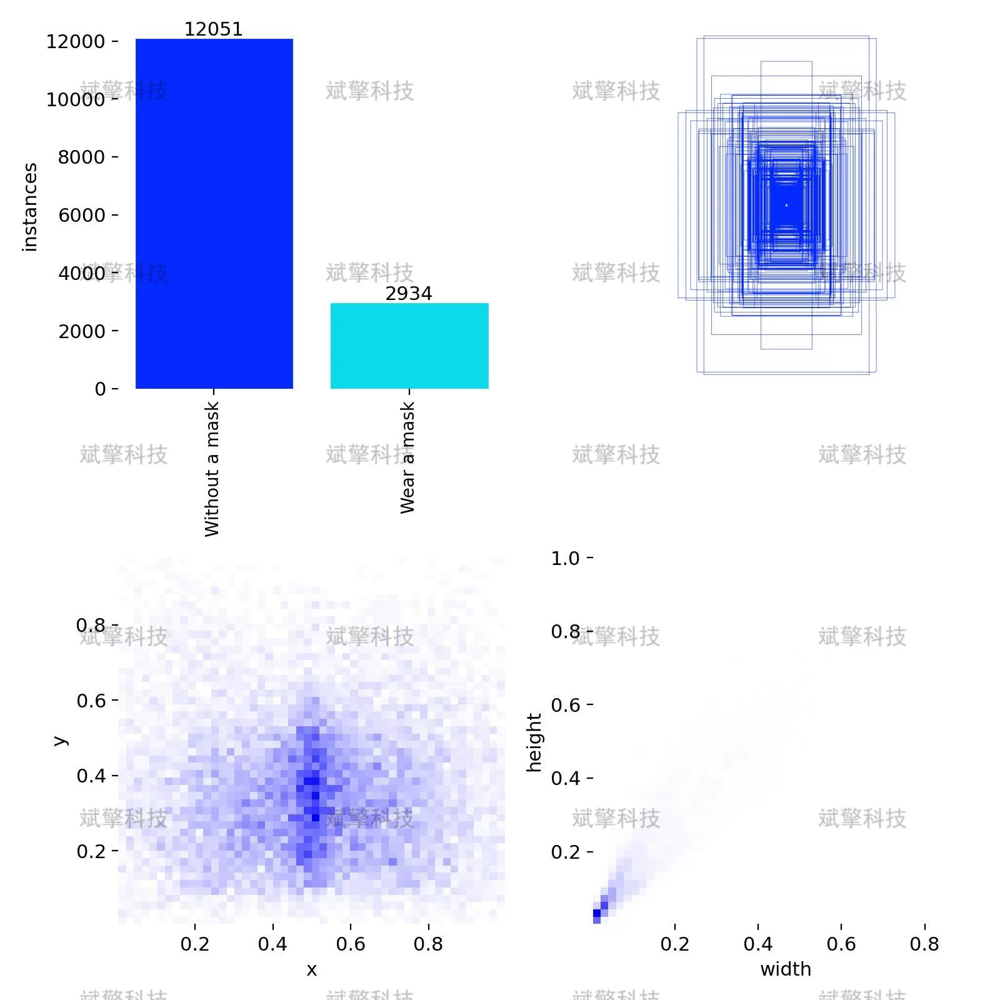
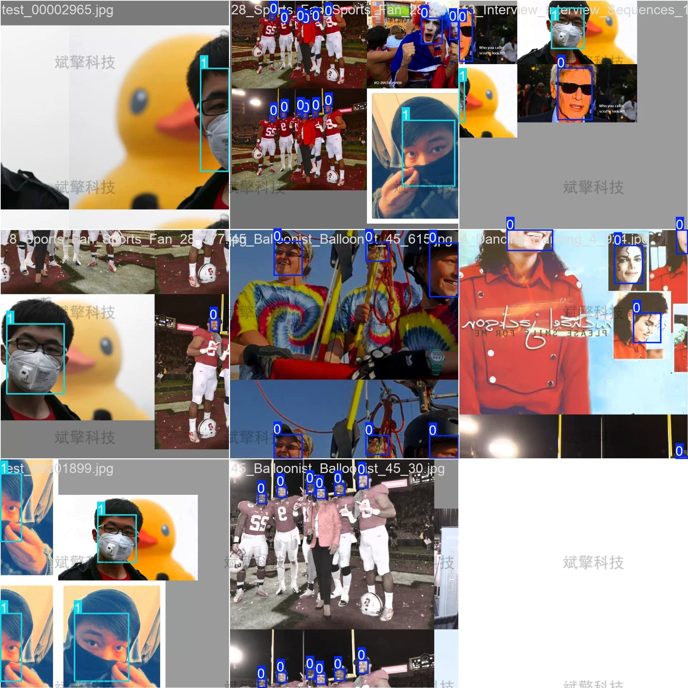
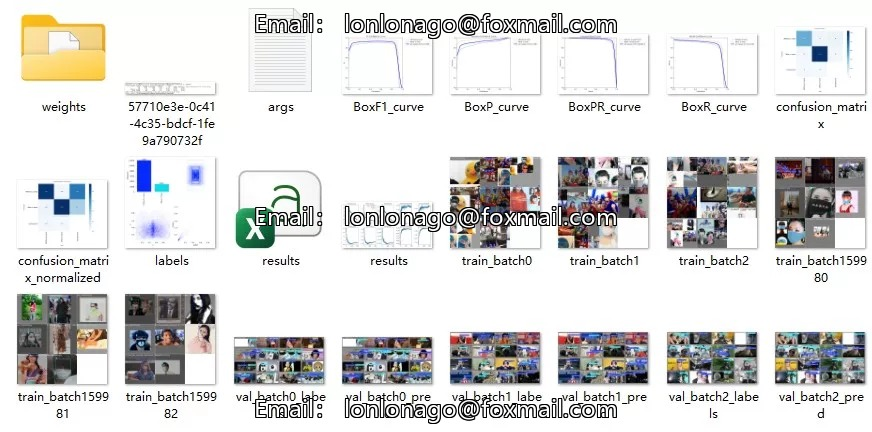
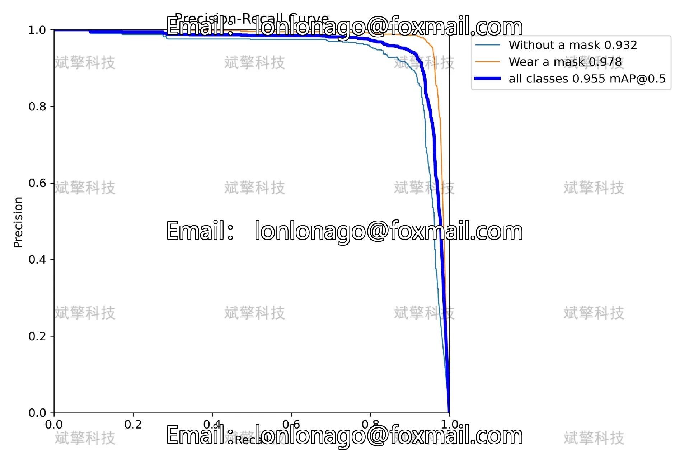
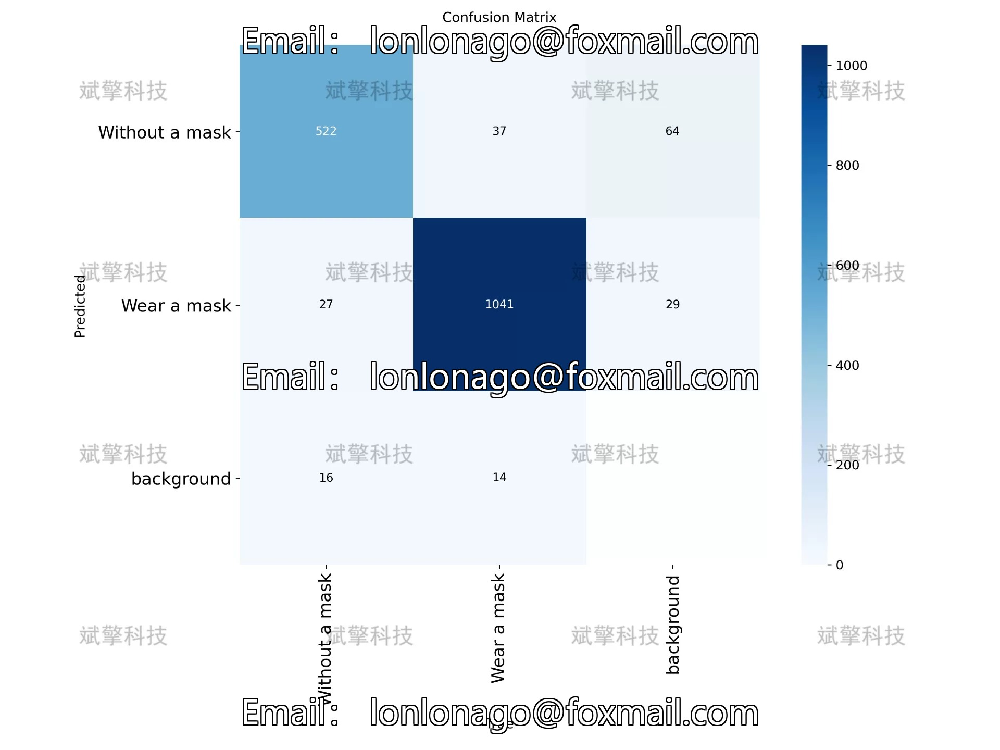
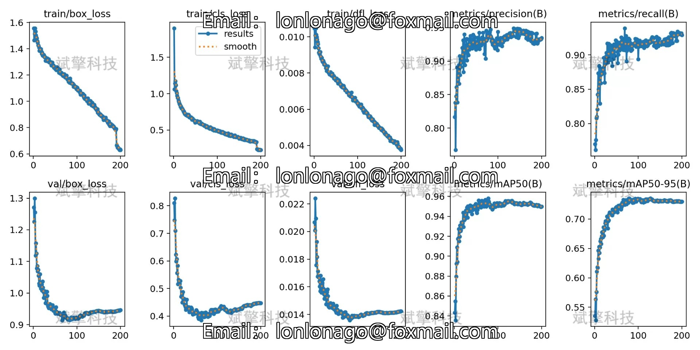
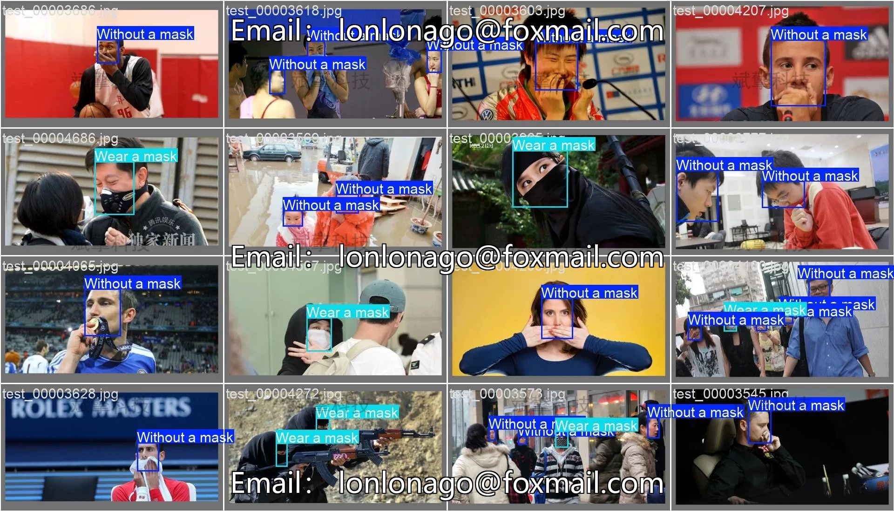
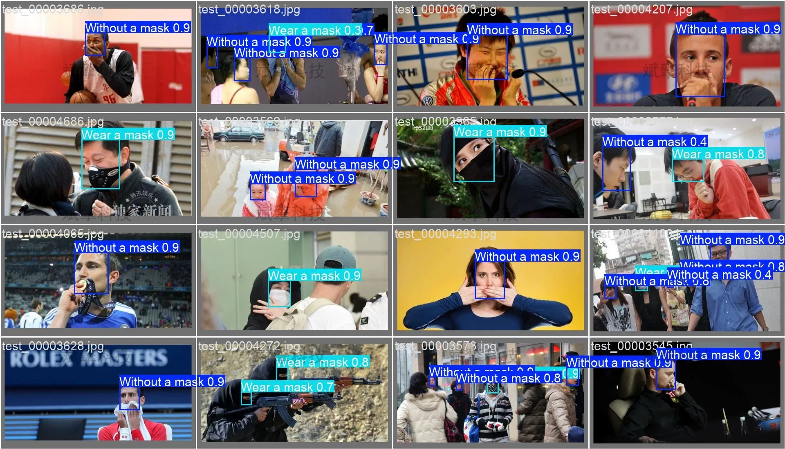

# YOLO26 Mask Recognition Detection System | Dataset

## Body

YOLO26 Nose Mask Identification System | Data Set for Smart Security - The Full Process from Dataset Construction, Model Training to Deployment

This study builds an efficient and accurate system for detecting the wearing of nose masks based on the YOLO26 object detection framework. The system intelligently recognizes and locates two key categories—not wearing a mask and correctly wearing a mask—and is suitable for public places' epidemic prevention needs. The experiment uses 6732 images as the training set and 1227 images as the validation set, training the YOLO26 model through end-to-end target detection. The validation results show that the model performs excellently in terms of detection accuracy and recall rate, with an overall mAP50 of 0.955, where the detection accuracy for the wearing mask category is 0.97, and for the not wearing mask category is 0.91. The model inference speed reaches 3.5ms/image, meeting the real-time detection requirements. The confusion matrix analysis shows that the model has a recognition accuracy of 95% for the wearing mask category and 92% for the not wearing mask category, demonstrating good robustness and practicality. This system can provide effective technical support for intelligent epidemic management in public places.

The dataset contains two detection targets, specifically defined as follows:

Category Name    Category ID    Definition
Without a mask    0    Individual without a mask covering their face area, or improperly wearing a mask (such as hanging the mask under the chin, only covering the mouth, revealing the nose, etc. considered not correctly worn)
Wear a mask    1    Individual fully covered by a mask over their face area, with the mask covering the mouth and nose area, and wearing position correct
Dataset Scale and Division
To ensure the effectiveness of model training and evaluation reliability, the dataset is divided into a training set and a validation set according to a certain proportion:

Dataset    Image Count    Percentage    Usage
Training Set    6732 Images    84.6%    Model training and parameter optimization
Validation Set    1227 Images    15.4%    Model performance evaluation and verification

Free reservation for remote installation. Unsuccessful full refund.
Purchase Enjoy the following resources (Baidu Drive automatically unlocks)
   - YOLO Identification Detection Project Complete Source Code
   - YOLO format dataset
   - Training code + UI interface code
   - Trained model + result images
   - Software install package
   - Add WeChat reservation for remote installation (Automatically display WeChat ID after purchase) - Unsuccessful, full refund

⚙️ Core Functional Modules
Detection Capability
   - Image Detection: Upon upload, returns detection boxes + category information
   - Video Detection: Supports video files, analyzes frames accurately
   - Camera Real-Time Detection: Connects USB cameras to achieve dynamic monitoring
Interaction and Control
   - Target Filtering: Choose one or more categories for detection
   - Parameter Real-Time Adjustment: Adjustable confidence threshold & IoU threshold, flexible control precision
   - Results Save: One-click save images/video/camera detection results
System and Data
   - User Login and Registration: Support password strength check + Encrypted storage
   - Log Recording: Automate operation and error logging (with timestamp)

## Images

## Payment

Here is a pay link on Stripe ( https://buy.stripe.com/3cs8yP7sY87d0vu9AB ). Please contact me lonlonago@foxmail.com after funding $89, and I will send you a complete data files , thank you!

